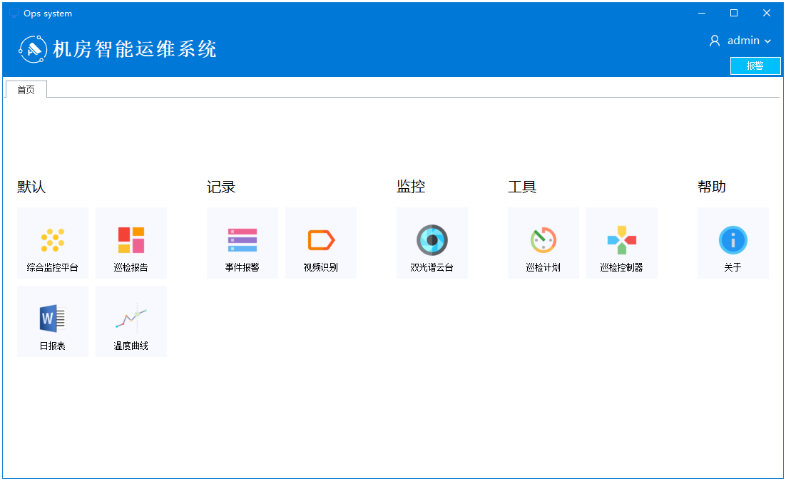

## 1. 系统介绍
### 1.1. 巡检平台

巡检机器人软件平台（以下简称巡检平台），采用插件组合式架构设计，各功能模块以模块插件方式运行，巡检平台通过统一的模块插件接口实现插件的加载与卸载，平台与各模块插件间通过消息总线实现数据交换与动作协调，以实现整个巡检平台模块间的协作。

### 1.2. 功能模块

目前系统的主要功能由9个巡检平台模块和5个工具模块实现。 其中巡检平台模块包括：插件核心模块、数据库模块、视频采集模块、视频识别模块、报警管理模块、巡检报表模块、温湿度曲线模块、Web浏览器模块、短信服务模块；工具模块包括：视频标注工具、视频识别工具、专用视频播放器、巡检机器人控制器、巡检机器调度器。

