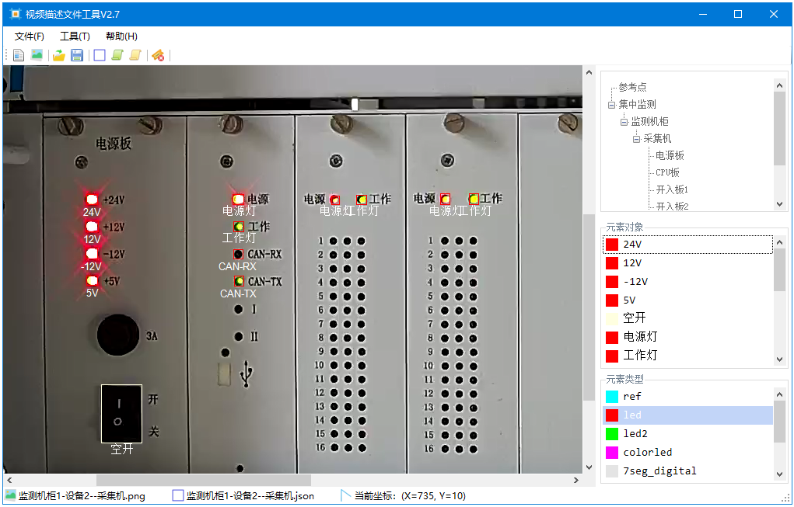
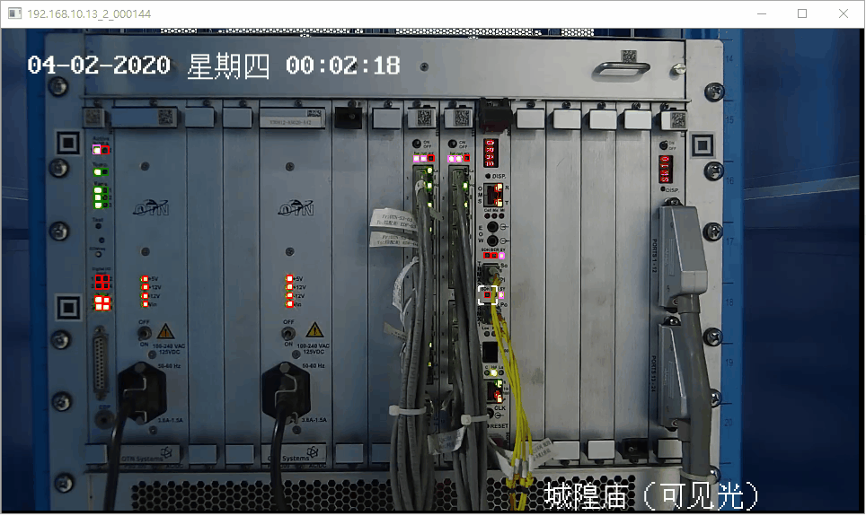
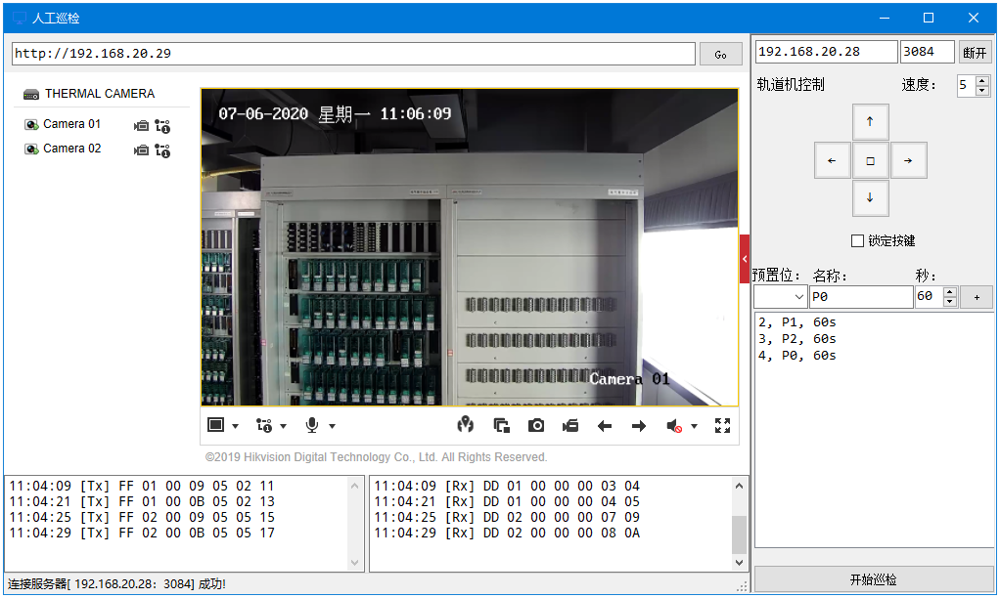
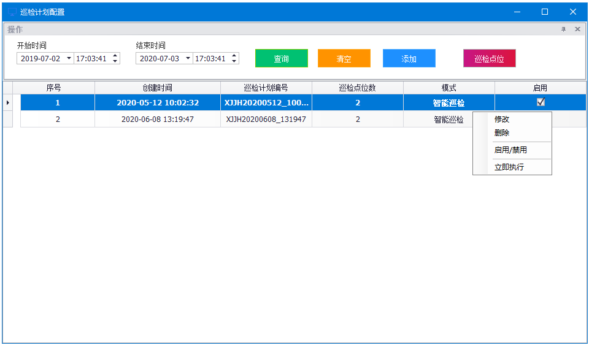
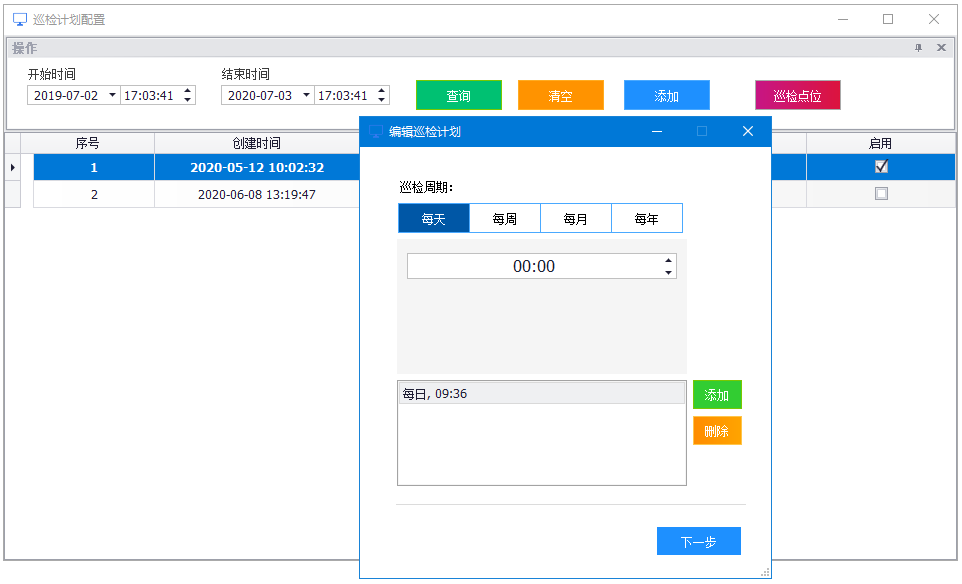

## 6. 工具模块

### 6.1 视频标注工具



#### 6.1.1 视频识别标注文件

视频识别标注文件（JSON视频描述文件）是一种对视频里的目标区域进行标注的JSON格式文件。

**示例文件：**D:\D:\video\preset\监测机柜1-设备1--机柜电源.json


```json
{
    "version": "V3",
	"configDocLocal": {
		"preproc": {
			"RefImagePath": "D:/video/preset/ref/监测机柜1-设备1--机柜电源.png",
			"Relocate": {
				"REF_TL": null,
				"REF_TR": null,
				"REF_BL": null,
				"REF_BR": null
			},
			"LightCompensation": {
				"blockSize": 18
			},
			"AdaptiveThreshold": {
				"blockSize": 55,
				"constValue": -40
			}
		},
		"led": {
			"threshold_on": 0.9,
			"threshold_off": 0.04

		},
		"LightCompensation": {
			"blockSize": 40
		}
	},
	
    "SheetName": "集中监测",
    "Items": [
        {
            "SystemName": "监测机柜",
            "Items": [
                {
                    "DeviceName": "机柜电源",
                    "Items": [
                        {
                            "BoardName": "机柜电源",
                            "Items": [
                                {
                                    "rect": {
                                        "height": 42,
                                        "left": 1053,
                                        "top": 268,
                                        "width": 42
                                    },
                                    "color": "红",
									"intensity_def": 100,
                                    "id": "电源灯",
                                    "type": "led",
                                    "normal": {
                                        "亮": "红色常亮"
                                    },
                                    "other": {
                                        "灭": "不亮，设备供电异常"
                                    }
                                },
                                {
                                    "rect": {
                                        "height": 139,
                                        "left": 446,
                                        "top": 376,
                                        "width": 132
                                    },                                   
                                    "id": "机柜-220V空开",
                                    "type": "switch"                                    
                                },
                                {
                                    "rect": {
                                        "height": 139,
                                        "left": 580,
                                        "top": 376,
                                        "width": 130
                                    },
                                    "id": "采集机-220V空开",
                                    "type": "switch"
                                },
                                {
                                    "rect": {
                                        "height": 139,
                                        "left": 712,
                                        "top": 376,
                                        "width": 135
                                    },
                                    "id": "电源盒-220V空开",
                                    "type": "switch"
                                }
                            ]
                        }
                    ]
                }
            ]
        }
    ]
}
```

#### 6.1.2 识别文件规范

视频识别标注文件（JSON视频描述文件）定义了视频标注文件格式，内容，以及参数定义等内容，详细定义请参考 **[附件1：长龙视觉模块 JSON 文件规范](./附件1：长龙视觉模块 JSON 文件规范_v5.md)** 


### 6.2 视频识别工具

**CvShell** 为视频识别工具，内部调用**CvModule**识别模块对目标视频文件进行识别，在巡检过程中，巡检平台将采集的视频与关联预置位的JSON视频描述文件通过消息发送到**CvShell**，调用**CvModule**识别模块对识别进行识别，识别模块执行完毕后，将识别结果的JSON文件通过消息发送到巡检平台处理。

**CvMoudle**识别模块识别**LED指示灯、OCR数码屏、指针表计、空气开关**等目标，识别结果以JSON识别结果文件形式返回。

#### 6.2.1 CvModule识别模块

**CvModule**识别模块存储在巡检平台的Lib目录，包括 **CvModule.dll、CvModule.Lib、globalConfig.json**三个文件，其中**CvModule.dll**为识别模块执行部分，**globalConfig.json**为识别模块配置文件。

- **globalConfig.json：****识别模块配置文件，需要指定OCR识别模块训练模型存储路径： `model_path`，其他设置请参考 **[附件1：长龙视觉模块 JSON 文件规范](./附件1：长龙视觉模块 JSON 文件规范_v5.md)** 

```json
{
  "debug": 16,
  "ocr": {
    "model_path": "D:/video/model",
    "lang": ["chi_sim", "eng"],
    "page_seg_mode": 3,
    "ppi": 70
  },
  "preproc": {
    "LightCompensation": {
      "blockSize": 40
    },
    "SIFT": {
      "lowe_ratio": 0.7,
      "ransac_reproj_threshold": 5.0
    },
	"AdaptiveThreshold": {
		"blockSize": 55,
		"constValue":-40
	}	
  },
  "led": {
    "threshold_on": 0.9,
    "threshold_off": 0.05
  },
  "led2": {
    "threshold_on": 0.9,
    "threshold_off": 0.05
  },
  "ColorLed": {
    "threshold_on": 0.9,
    "threshold_off": 0.05,
    "红": [0, 0, 255],
    "橙": [0, 125, 255],
    "黄": [0, 255, 255],
    "绿": [0, 255, 0],
    "蓝": [255, 0, 0]
  }
}
```

### 6.3 专用视频播放器

**VideoPlayer** 为巡检平台专用视频播放器，使用OpenCV实现视频文件的解析，帧编辑，通过JSON视频描述文件对识别目标进行动态标注显示，并根据识别结果对每帧视频进行透视修正。



### 6.4 巡检机器人控制器

**巡检机器人控制器 **使用**PelcoD**协议在后台实现对巡检机器人的运动控制，预置位设定、预置位调用、运动反馈控制等操作。实现巡检平台对机器人实体的控制，根据巡检计划控制机器人移动到预定的位置进行，以进行视频采集等操作。



### 6.5 巡检计划调度器

**巡检计划调度器** 实现巡检机器人按配置的巡检计划执行巡检的功能，到达指定巡检时刻时，向巡检平台发送巡检通知消息，并通过巡检机器人控制器控制巡检机器人到达设定的巡检点位，当所有巡检点位巡检完毕后，控制巡检机器人返回原点，以等待执行下一次巡检计划。

