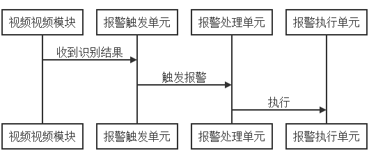

## 5. 巡检平台模块 {docsify-ignore}

### 5.1 插件核心模块

**Plugin.Core **是所有插件模块必须引用的基础模块，包含插件模块的接口定义，公用方法，消息总线、消息类型定义、日志记录等单元：

- **IPlugin：**插件接口单元

- **PluginInfo：**插件描述信息单元

- **PluginBase：**插件模块基类

- **PluginManager：**插件管理器，根据插件配置文件加载Plugins目录的插件

- **InnerBus：**内部消息总线，用于模块间发送消息到EventBus总线

- **MsgEvent：**消息类型定义

- **Logger：**日志记录单元


### 5.2 数据库模块

**StoreDB **数据库模块为巡检平台的数据库模块，实现用户记录、视频识别结果记录、视频采集记录、报警记录、巡检计划记录等相关数据的存储查询功能。

#### 5.2.1 数据库安装

安装并启动WampServer，任务栏图标为绿色表示MySql服务器已启动

- 安装MySql服务：

  打开Win系统服务，设置wampmysqld64为自动启动服务，其他的WampServer服务按需启动

#### 5.2.2 数据库配置

- 修改MySql 连接密码：

  启动WampServer的phpMyAdmin，进入MySql数据库管理界面，默认账户为root，密码为空，登录后修改MySql数据库登录密码为：root

- 修改MySql配置文件**my.ini**的内容

```csharp
在 [mysql] 下面加入
default-character-set=utf8

在[ mysqld ] 下面加
character_set_server=utf8
```

- 创建巡检平台数据库

  修改配置文件后，重启MySql服务，然后进入MySql数据库管理界面，创建lpsdata数据库，字符集为utf8_general_ci，运行巡检平台后会初始化相关数据库表。

#### 5.2.3 ORM框架

**StoreDB**数据库模块使用MySql数据库，使用SqlSugar ORM框架实现对巡检平台数据库的操作。在巡检平台的App.config配置文件实现配置了数据库连接信息:

**MySql数据库连接信息：**


```csharp
<add key="DataBase_ConnectionString" value="database = 'lpsdata'; Data Source = '127.0.0.1'; User Id = 'root'; pwd = 'root'; charset = 'utf8'; pooling = true" />
```


### 5.3 视频采集模块

**VideoSDK** 视频采集模块，通过海康设备SDK连接海康设备，控制云台和摄像头进行视频数据采集操作。

- **CHCNetSDK：**封装了海康设备SDK的接口单元，实现对海康设备的控制与数据采集。

- **VideoCapture：** 视频采集单元，完成海康设备的管理、云台的控制、可见光摄像头和热成像数据的采集和存储。

- **ThremalManager：** 热成像管理单元，实现对热成像摄像头目标区域温度的采集管理。

- **PreViewForm:** 视频采集预览单元，在视频采集过程中在显示当前采集的视频内容。

  


### 5.4 视频采集插件
**Plugin.Video** 视频采集插件，根据**DVR.config.json**视频设备配置文件和**OrbitPreset.config.json**预置位配置文件，通过**VideoSDK**视频采集模块实现视频的采集、存储、转发操作。

- **VideoHandler：**视频采集管理单元，接收消息总线的巡检通知消息，并根据巡检通知和配置文件调用指定摄像头对指定预置位的视频和热成像数据进行采集，并将采集结果存储到文件、数据库，并通过消息总线转发到视频识别插件。

  

### 5.5 视频识别插件

**Plugin.Recognition** 视频识别插件，根据消息总线收到的视频数据和关联的视频标注文件调用视频识别工具进行识别。

- **RecognitionHandler：** 视频识别管理单元，对收到的视频数据进行识别处理，并将识别结果存储到巡检平台识别结果数据库表，同时通过消息总线发送到报警插件处理。

- **RecognitionViewForm：** 视频识别结果查询界面，根据条件查询并显示视频识别结果。

  

### 5.6 报警处理插件

**Plugin.Alarm** 报警处理插件，根据识别结果检查是否触发报警，提取触发报警记录，以弹出式窗口显示报警内容，调用短信服务模块发送短信报警，同时将报警数据存储到巡检平台报警数据库表。

- **AlarmHandler：** 报警管理单元，对收到的识别结果进行分析，转对应的报警处理单元处理，并将结果存储到巡检平台报警数据库表。

- **AlarmPopupForm：**弹出式报警窗口，从识别结果检测到报警记录后，以弹出式窗口置顶显示报警记录，并允许用户处理报警。

- **AlarmViewForm：** 报警结果查询界面，根据添加查询报警记录。

#### 5.6.1 报警处理流程
收到视频识别结果后，检查识别结果是否有触发报警项记录，提取报警记录，并转报警处理单元调用具体的报警处理方法处理。



#### 5.6.2 报警执行单元
报警执行根据根据报警类型调用具体的报警执行单元，由报警处理单元工厂生成具体的报警执行方法，并加入到报警执行单元列表。

**报警执行单元类型：**

- 存储报警记录
- 弹出报警窗口
- 发送报警短信
- 发送报警邮件


### 5.7 巡检报表插件

**Plugin.PatrolReport** 巡检报表插件，根据巡检计划通知，生成巡检报表和日报表。

收到开始新巡检时，开始创建新报表，创建时巡检生成报表名，巡检过程中收到录像或识别结果、温度结果时都更新到当前报表。

巡检报表分为巡检报表和日报表，巡检报表记录的是每个点位的识别记录，包括点位照片，环境温湿度信息。日报表则根据巡检日报表模板和日报表配置文件生成，包括识别记录和热成像温度信息，生成的日报表为Docx格式。

- **PatrolReportHandler：** 巡检报表处理单元，处理巡检报表和日报表的操作。

- **PatrolReportManager：** 巡检报表管理器，实现巡检报表的生成和数据的更新与存储。

- **PatrolReportViewForm：** 巡检报表查询界面，管理与查询巡检报表与日报表记录。

- **DailyReportConfig：** 日报表配置文件，关联日报表与日报表模板的配置。

- **DocxTemplate：** 日报表模板文件，Docx格式，根据模板与日报表配置文件生成Docx格式的日报表。

- **DailyReportManager：** 日报表管理单元，实现日报表文件的生成和模板数据的更新与存储。


### 5.8 温湿度曲线插件

**Plugin.DataChart** 图表显示插件，以图表方式显示环境温湿度曲线和热成像温度曲线。

**ChartViewForm：** 温湿度曲线查询界面，查询指定时间范围的环境温湿度和各巡检点位的热成像温度信息，并以曲线的方式绘画在图表窗口。多个曲线并列显示。


### 5.9 Web浏览器插件

**Plugin.HikPlatform** 内嵌Chrome内核和IE内核的Web浏览器插件，根据配置选择不同的Web内核。

**WebViewForm：** 主要显示嵌入式Web页的内容，包括海康平台，海康摄像头设备的Web管理页面。巡检平台通过js脚本实现对Web页面的交互与修改。


### 5.10 短信服务模块

**SmsLib** 短信服务模块，实现报警短信的发送功能。

**SmsManager：**短信服务管理单元，通过电信企业短信平台实现短信发送

**SmsConfig：**短信配置文件，配置接收报警短信的手机号列表