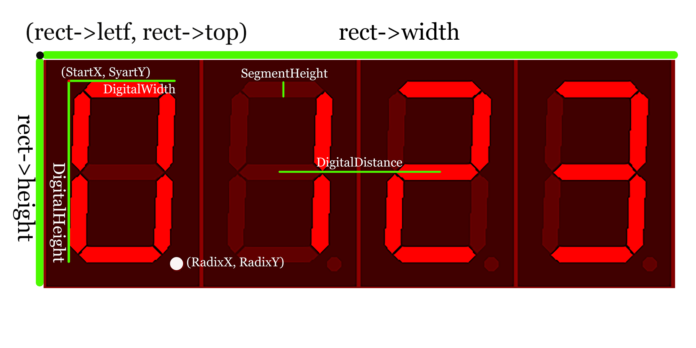

# 长龙视觉模块 JSON 文件规范

## 目录

+ [涉及 JSON 配置文件的接口](#涉及-json-配置文件的接口)
+ [全局配置 globalConfig.json](#全局配置-globalconfigjson)
    + [代码样例](#代码样例)
    + [代码结构](#代码结构)
    + [开发人员引用参数的方法](#开发人员引用参数的方法)
+ [局部配置 video_description.json](#局部配置-videodescriptionjson)
    + [代码基本结构样例](#代码基本结构样例)
    + [Type: "led" 定义](#type-led-定义)
    + [Type: "led2" 定义](#type-led2-定义)
    + [Type: "colorled" 定义](#Type: "colorled" 定义)
    + [Type: "gauge" 定义](#Type: "gauge" 定义)
    + [Type: "switch" 定义](#Type: "switch" 定义)
    + [Type: "7seg_digital" 定义](#Type: "7seg_digital" 定义)
+ [错误代码提示中文说明](#错误代码提示中文说明)

## 涉及 JSON 配置文件的接口

长龙视觉模块 CvModule 三个对外接口中涉及了两个 json 配置文件：

```cpp
/* 读取全局配置文件，生成模块句柄 */
SZARCVLIB_API CvErrorCode cvModuleCreate(
    const char* majorConfigFile, 
    HANDLE*     handle
);

/* 读取视频、视频描述json进行处理，结果json输出到指定文件夹 */
// 结果文件名：视频文件名-result.json
SZARCVLIB_API CvErrorCode cvModuleBatchProc( 
    HANDLE       handle,
    const char*  videoFile,	
    const char*  jsonDescriptionFile,
    const char*  jsonOutputPath 
);

/* 释放模块句柄 */
SZARCVLIB_API void cvModuleDestroy(
    HANDLE handle
);
```

- `globalConfig.json` 全局配置：路径传递给 `majorConfigFile`，主要存储各个 task 模块算法需要的参数，由算法工程师具体给出，通常情况下不要修改该文件的内容。

- `video_description.json` 局部配置：路径传递给 `jsonDescriptionFile`，主要存储视频图像中各个部件的坐标框、类型以及标准图像路径等相关信息，也具有覆盖全局算法参数的能力，该文件由标注人员给出。

## 全局配置 globalConfig.json

### 代码样例

```json
{
  "debug": 8,
  "ocr": {
    "model_path": "../bin/",
    "lang": ["chi_sim", "eng"],
    "page_seg_mode": 3,
    "ppi": 70
  },
  "preproc": {
    "LightCompensation": {
      "blockSize": 40
    },
    "SIFT": {
      "lowe_ratio": 0.7,
      "ransac_reproj_threshold": 5.0
    },
	"AdaptiveThreshold": {
		"blockSize": 55,
		"constValue":0
	}
  },
  "led": {
    "threshold_on": 0.9,
    "threshold_off": 0.05
  },
  "led2": {
    "threshold_on": 0.9,
    "threshold_off": 0.05
  },
  "ColorLed": {
    "threshold_on": 0.9,
    "threshold_off": 0.05,
    "红": [1, 11, 165,180],
    "橙": [11, 26],
    "黄": [26, 35],
    "绿": [35, 77]
  }
}
```

### 代码结构

- 调试结果输出选择参数定义

  - `"debug": 8` 调试选项，详见CvModule.h定义：

    ```cpp
    DEBUG_PREPROC_IMAGE_BEFORE_DFS = 1,   	 // 1，在处理JSON结果前输出预处理图片
    DEBUG_PREPROC_IMAGE_AFTER_DFS  = 1 << 1, // 2，在处理JSON结果后输出预处理图片
    DEBUG_LOGGING                  = 1 << 2, // 4，输出Log文件
    DEBUG_RAW_RESULT_ON            = 1 << 3, // 8，结果JSON文件中包含“raw_result”
    DEBUG_PERSPECTIVE_MATRIX_ON    = 1 << 4  // 16, 结果JSON文件中输出透视矩阵	DEBUG_SIFT_EVERY_FRAME         = 1 << 5	 // 32, 开启防抖功能，每帧都做对齐处理
    ```

    这些选项可以叠加，将他们的值加起来即可。比如需要开启防抖功能，然后在结果JSON文件中输出raw_result和透视矩阵，则debug值应为8+16+32=56。

- 文字识别模块OCR参数定义

  - `model_path`: 模型文件的路径，目前支持的模型文件包括三个：

    chi_sim.traineddata
    chi_sim_vert.traineddata
    eng.traineddata

  - `lang`: 支持的语言，目前支持简体中文（chi_sim）和英文（eng）

  - `page_seg_mode`: 传给Tesseract的参数

    | 成员名                     | 值   | 描述                                                         |
    | -------------------------- | ---- | ------------------------------------------------------------ |
    | PSM_OSD_ONLY               | 0    | 仅方向和脚本检测（OSD）。如需使用OSD功能，则需要下载[osd.traineddata](https://github.com/tesseract-ocr/tessdata/raw/master/osd.traineddata) |
    | PSM_AUTO_OSD               | 1    | 利用OSD进行自动页面分割。                                    |
    | PSM_AUTO_ONLY              | 2    | 自动页面分割，但没有OSD或OCR。                               |
    | PSM_AUTO                   | 3    | 全自动页面分割，但没有OSD。（默认。）                        |
    | PSM_SINGLE_COLUMN          | 4    | 假定一列可变大小的文本。适用于画面中仅有一列不同大小的文字的识别。 |
    | PSM_SINGLE_BLOCK_VERT_TEXT | 5    | 假定一个统一的垂直对齐文本块。适用于竖屏文本块的识别。       |
    | PSM_SINGLE_BLOCK           | 6    | 假定一个统一的文本块。适用于多行文本块。                     |
    | PSM_SINGLE_LINE            | 7    | 将图像视为单个文本行。适用于图像中仅有一行文字的识别。       |
    | PSM_SINGLE_WORD            | 8    | 将图像视为单个词。适用于图像中仅有一个单词的识别。           |
    | PSM_CIRCLE_WORD            | 9    | 将图像视为一个圆圈中的单个词。适用于图像中带圆圈的特殊字符的识别。 |
    | PSM_SINGLE_CHAR            | 10   | 将图像视为单个字符。适用于图像中仅有一个字符的识别。         |
    | PSM_SPARSE_TEXT            | 11   | 以无特定顺序查找尽可能多的文本。                             |
    | PSM_SPARSE_TEXT_OSD        | 12   | 带有方向和脚本检测查找文本。                                 |
    | PSM_RAW_LINE               | 13   | 将图像视为一个单独的文本行，绕过特定于tesseract的技巧。      |

  - ppi`: 预设的图像的PPI（points per inch），一般不需要改动

- 预处理流程 preproc 特有的各个算法的参数定义，如样例中的

    + `LightCompensation` 光照补偿
      + `blockSize` : 光补偿处理时分割子块的大小，取值越小，处理后整体亮度越统一；取值越大，亮度细节保留越多。如果要给某个机柜的灯统一设定一个阈值才会用到，且需要在该机柜的json文件中的"led"那一项添加自定义固定亮度阈值"intensity_def"参数配合使用。
    + `SIFT` 图像对齐
      + SIFT算法内部需要设定的阈值，一般不需要改动。
    + `AdaptiveThreshold` 自适应阈值化
      + `blockSize` : 每个像素的二值化阈值由邻域像素的分布来决定，blockSize是当前像素的邻域块大小，**只能取奇数**。
      + `constValue` : 偏移值调整量。计算阈值后，再减去这个值就是最终阈值，该值可以是正数、0 或负数。 
      + 在设置参数时，根据经验，一般blockSize要大于灯的直径，如果要整体调高阈值，则调低constValue，反之就调高。
    
- 各 task 模块（如样例中的`led`，`led2`，`ColorLed`）参数定义
    - `led` : 处理单个无需判断颜色的led灯
      - `threshold_on` :  raw_result中亮的帧数占总帧数比例 >= threshold_on即将该灯判断为亮，该值不能大于1。
      - `threshold_off` : raw_result中亮的帧数占总帧数比例 < threshold_off即将该灯判断为灭，不能小于等于0。
    - `led2 `: 处理多个无需判断颜色的led灯
      - `threshold_on` 与 `threshold_off`  参数定义与`led` 一致。
    - `ColorLed` :  处理单个需要判断颜色的led灯
      - `threshold_on` 与 `threshold_off`  参数定义与`led` 一致。
      - `"红"`、`"橙"` 等为led灯的颜色定义。所带的参数为HSV颜色空间中色彩通道H(Hue)的值，总的范围是0~179。注: 一般情况下红色有两个范围：1~10和165~179，标注时按顺序写即可：[1, 11, 165, 180]。

### 开发人员引用参数的方法

- 在 task 模块中，以 `taskLed` 为例
  
    ```cpp
    float threshold_on = moduleHandle->configDocLocal["led"]["threshold_on"].GetFloat();
    float threshold_off = moduleHandle->configDocLocal["led"]["threshold_off"].GetFloat();
    ```

- 在预处理 preproc 模块中，以 `preprocLightCompensation` 为例
  
    ```cpp
    int blockSize;
    try {
        blockSize = moduleHandle->configDocLocal["preproc"]["LightCompensation"]["blockSize"].GetInt();
	}
    catch (std::exception err) {
        throw std::runtime_error("PRE_LIGHT_CMP_NO_BLOCKSIZE"); 
    }
    ```
    
  > :warning: 开发人员应当总是在 `moduleHandle->configDocLocal` 中读取参数，这样如果局部配置覆盖了全局配置的话，读到的是局部的参数值

## 局部配置 video_description.json

### 代码基本结构样例

```json
{
  "configDocLocal": {
    "preproc": {
      "RefImagePath": "../ref_img/传输机柜_.jpg"
    }
  },
 
  ... 以下为具体标注的嵌套结构 ...

}
```

局部配置文件由两个部分组成：

1. 算法参数配置 `"configDocLocal"`。上面样例给出了最简实现。

    > :warning: `"configDocLocal"` -> `"preproc"` -> `"RefImagePath"` 这个参数必须要有，否则无法进行图像对齐。若缺失或者无法打开标注参考图像，`cvModuleBatchProc` 接口将返回 `PRE_PARSE_REFIMAGEPATH_FAILED (32)` 错误

    一个较为完整的 `"configDocLocal"` 可参考以下写法

    ```json
    {
    	"configDocLocal": {
    		"preproc": {
    			"RefImagePath": "../ref_img/传输机柜_.jpg",
    			"Relocate": {
    				"REF_TL": {
    					"height": 107,
    					"left": 122,
    					"top": 167,
    					"width": 110
    				},
    				"REF_TR": {
    					"height": 100,
    					"left": 1602,
    					"top": 164,
    					"width": 101
    				},
    				"REF_BL": {
    					"height": 109,
    					"left": 113,
    					"top": 538,
    					"width": 116
    				},
    				"REF_BR": null
    			},
    			"LightCompensation": {
    				"blockSize": 40
    			},
    			"AdaptiveThreshold": {
    				"blockSize": 75,
    				"constValue":-25
    			}
    		},
    		"led": {
    			"threshold_on": 0.9,
    			"threshold_off": 0.05
    		},
            "ColorLed": {
    			"红": [1, 11, 170,180],
    			"绿": [36, 77]
    		}
    	},
      ... 以下为具体标注的嵌套结构 ...
    }
    ```

    以上代码片段实现了这些事情

    - （必须有）`"RefImagePath"` 指定了标注参考图像的路径

    - （最好有）`"Relocate"` 指定了回字定位图案的坐标框，其中，"REF_TL" 代表左上角，"REF_TR" 代表右上角，"REF_BL" 代表左下角，"REF_BR" 代表右下角，一般回字定位图案贴三个就足够了。尽管当前使用了 SIFT 特征点匹配算法使得不需要回字进行定位，但将来它们可用于检验特征点匹配是否成功

    - （可选）这里 `"LightCompensation"` 和`"AdaptiveThreshold"`修改了 preproc 预处理流程中的全局参数，`"led"` 修改了 task 任务处理模块的全局参数

2. 具体标注的嵌套结构。这个嵌套结构可以由用户自定义，只需要符合 json 格式的规范即可。对于一个设备中的一个具体检测部件，其基本结构为

    ```json
    {
      "id": "xxx",
      "type": "yyy",
      ... 以下为 type 相关的参数 ...
    }
    ```

    其中，`"id"` 和 `"type"` 为所有部件必须要有的键。其他键值参考不同部件 `"type"` 的具体定义。

### Type: "led" 定义

```json
{
  "id": "5V",  			  // [必选] ID名
  "rect": {               // [必选] 位置矩形框
    "height": 10,         // [必选] 矩形框高
    "left": 337,          // [必选] 矩形框左上角点距离画面左边的像素偏移
    "top": 523,           // [必选] 矩形框左上角点距离画面顶部的像素偏移
    "width": 10           // [必选] 矩形框宽
  },
  "type": "led",          // [必选] 部件类型，单个led
  "color": "绿",          // [必选] LED颜色
  "threshold_on": 0.96,   // [可选] 局部阈值：判定亮
  "threshold_off": 0.04,  // [可选] 局部阈值：判定灭
  "normal": {
           	 	"亮": "绿色常亮"
  },						// [必选] 正常情况输出
  "other": {
            	"灭": "不亮,电源输出异常"
  }							// [必选] 异常情况输出
}
```
返回"result"

- "亮"：判定为亮的帧占总帧数比例 >= threshold_on
- "灭"：判定为亮的帧占总帧数比例 < threshold_off
- "闪"：其他情况

### Type: "led2" 定义

```   json
{
   "id": "Temp",			// [必选] ID名
 	"rect": {				// [必选] 位置矩形框
        "height1": 19,		// [必选] 第一个灯的矩形框高
        "left1": 230,       // [必选] 第一个灯的矩形框左上角点距离画面左边的像素偏移
        "top1": 275,        // [必选] 第一个灯的矩形框左上角点距离画面顶部的像素偏移
        "width1": 19,       // [必选] 第一个灯的矩形框宽
        "height2": 19,		// [必选] 第二个灯的矩形框高
        "left2": 246,       // [必选] 第二个灯的矩形框左上角点距离画面左边的像素偏移
        "top2": 274,        // [必选] 第二个灯的矩形框左上角点距离画面顶部的像素偏移
        "width2": 18        // [必选] 第二个灯的矩形框宽
    },
    "color": [          	// [必选] 各个LED灯分别的颜色
         "绿",
         "红"
     ],
     "type": "led2",        // [必选] 部件类型，2个led为一组
     "normal": {
         "亮灭": "左绿色常亮  右不亮"			// [必选] 正常情况输出
     },
     "other": {
         "亮亮": "红色常亮,温度异常"			// [必选] 异常情况输出
     }
}
```

返回"result"

- "亮"：单个led灯判定为亮的帧占总帧数比例 >= threshold_on
- "灭"：单个led灯判定为亮的帧占总帧数比例 < threshold_off
- "闪"：其他情况
- 一组多个led灯的result输出为单个led灯结果的组合，比如“亮亮”、“亮灭”、“亮闪” 。。。

### Type: "colorled" 定义

```  json
{
   "id": "hw",					// [必选] ID名
   "type": "colorled",        	// [必选] 部件类型，需判断颜色的单个led
   "color": ["绿", "红"],		   // [必选] led灯可能出现的颜色
    "color_def_HSV":			// [可选] 局部参数：对对应的led颜色重新定义
    {
        "绿":[33,78],
        "红":[1,10,170,180]
    },	
    "rect": {					// [必选] 位置矩形框
        "height": 16,			// [必选] 矩形框高
        "left": 957,          	// [必选] 矩形框左上角点距离画面左边的像素偏移
        "top": 241,           	// [必选] 矩形框左上角点距离画面顶部的像素偏移
        "width": 16           	// [必选] 矩形框宽
    },
    "normal": {
        "绿亮": "绿色常亮"		// [必选] 正常情况输出
    },
    "other": {
        "红亮": "红色常亮,板卡电源故障",
        "灭": "不亮,无电源输入"
    }							// [必选] 异常情况输出
}
```

返回"result"

- "亮"：判定为亮的帧占总帧数比例 >= threshold_on
- "灭"：判定为亮的帧占总帧数比例 < threshold_off
- "闪"：其他情况
- colorled的result输出为颜色判断+亮灭判断的结果组合(灭时不判断颜色)，比如“绿亮”、“灭”、“绿闪” 。。。

### Type: "gauge" 定义

``` json
{
   "id": "电流指示(A)",				  // [必选] ID名
   "rect": {						// [必选] 位置矩形框
       "height": 131,				// [必选] 矩形框高
       "left": 1244,          		// [必选] 矩形框左上角点距离画面左边的像素偏移
       "top": 239,           		// [必选] 矩形框左上角点距离画面顶部的像素偏移
       "width": 230           		// [必选] 矩形框宽
   },
   "type": "gauge",        			// [必选] 部件类型，指针表
   "range": [0,30]	        		// [必选] 表的量程范围				
}
```

返回"result"

- 指针所指数值

### Type: "switch" 定义

```json
{   
	"id": "空开",				   // [必选] ID名
    "rect": {					// [必选] 位置矩形框
        "height": 77,			// [必选] 矩形框高
        "left": 507,          	// [必选] 矩形框左上角点距离画面左边的像素偏移
        "top": 324,           	// [必选] 矩形框左上角点距离画面顶部的像素偏移
        "width": 102           	// [必选] 矩形框宽
    },
    "type": "switch"		    // [必选] 部件类型, 空气开关
}
```

返回"result"

- “开”：开关向上拨
- “关”：开关向下拨

### Type: "7seg_digital" 定义

该类型为数码管检测的配置环节

```json
{
  "id": "LCD2",			 		 // [必选] ID名
  "rect": {				 
    "height": 65,		 		 // [必选] 矩形框高
    "left": 549,		 		 // [必选] 矩形框左上角点距离画面左边的像素偏移
    "top": 322,			 		 // [必选] 矩形框左上角点距离画面顶部的像素偏移
    "width": 262				 // [必选] 矩形框宽
  },
  "type": "7seg_digital",        // [必选] type类型
  "N": 8,						 // [必选] 数码管的数量（包含未亮起的数码管）
  "DigitalDistance": 31,	     // [必选] 两个数码管之间的距离
  "DigitalWidth": 25,			 // [必选] 单个数码管的宽度
  "DigitalHeight": 36,			 // [必选] 单个数码管的高度
  "SegmentHeight": 5,			 // [必选] 单个数码管的段选高度
  "Angle": 9.46,				 // [必选] 单个数码管的旋转角度
  "StartX": 9,					 // [必选] 数码管的起始坐标（左上角x坐标）
  "StartY": 16,					 // [必选] 数码管的起始坐标（左上角y坐标）
  "RadixX": 0,					 // [可选] 数码管中小数点坐标（不用时置0）
  "RadixY": 0,					 // [可选] 数码管中小数点坐标（不用时置0）
  "BinaryValue": 200,			 // [可选] 二值化阈值（默认为0）
  "InvFlag": false,         	 // [可选] 数码管亮起颜色反转（默认为False）
  "DilateFlag": false		  	 // [可选] 是否使用膨胀（默认为False）
}
```

#### 参数详解

1. rect：ROI区域（在此区域内只关注数码管）的信息，
	-  rect->width，rect->height，两个参数对应了用户ROI区域的长和宽，
	-  rect->left，rect->top对应的ROI区域左上角的坐标（x, y）。
2. DigitalDistance：
	
	- 两个数码管之间的距离。***数码管的个数 N × DigitalDistance 必须小于ROI区域的长度rect->width***。
4. DigitalWidth、DigitalHeight：
	
	- 是指***单个数码管***的宽与高，而非数码管的段选长度
5. SegmentHeight：
	
	- ***数码管的段选高度***，对应的是数码管段选的短的一端
6. Angle：
	
	- 指单个数码管的旋转角度，数码管本身自带一定倾斜，正常标准数码管一般范围在8~12°左右
6. StartX、StartY：
	- 是指数码管的起始位置，与rect的参数不同，其区别是rect是画面的起始坐标。
- 相对于StartX、StartY来说就是（0，0）而StartX、StartY是数码管真正的开始位置
7. RadixX、RadixY：
	- 是***第一个小数点***的坐标，如：1234中，1的小数点
	- 如果画面中并没有小数点，则这两个参数都输入0即可。
9. BinaryValue：
	- 此参数是给画面二值化使用的，在大部分情况下，程序有自己的自适应二值化参数，用户并不需要为此输入，所以默认输入0时，程序执行自己的自适应二值化。但针对极端的情况，如强光照射，用户则需要自己调参数，范围为1~255。
10. InvFlag：
	 - 此参数是用在数码管颜色不确定的情况下使用的
	 - 正常数码管是背景为黑色，数码管为亮色（白色），此参数为false
	 - 假设遇到较为不常见的数码管，比如：数码管是背景为亮色，数码管为黑色，此参数可改为true
11. DilateFlag：
	 - 此参数用与程序调参，一般与InvFlag共同使用
	 - 在强光环境下，二值化阈值过高，导致数码管被细化严重，需要膨胀处理，正常情况不需要开启。默认为false，如需使用，此参数置为true。

#### 图例



返回"result"

- 具体识别结果

#### 调参经验

1. ROI区域选取：一般保证画面中心是数码管，数码管四周离边缘20个像素点左右即可
2. 两个数码管之间的间距、数码管的宽高、段选宽度：是指具体的像素点个数，一般拿PhotoShop度量即可。
3. 数码管倾斜角度：这里不是整个数码管显示屏，而是单个数码管，一般数码管会微微倾斜，度数为8~12°左右
4. StartX、StartY：第一个数码管的左上角坐标，只有第一个数码管的坐标对了，后面的数码管位置才是对的。也是用PS去量就好了。但是这里的坐标系的原点是从ROI区域开始，不是从原图开始算。
5. RadixX、RadixY：也是拿PS去量在ROI区域的位置，一般默认地铁系统中只有一个小数点。
6. BinaryValue：针对光照不好的条件才使用的范围是0-255，如果光照不均匀的时候，就手动调节。正常室内灯照射就是150，如果让程序自己调节就输入0即可。
7. InvFlag：一般正常的数码管背景是暗色的，段选是亮色的。这时候就属于正常的情况，不需要负片情况，如果背景色是亮色，数码管是暗色的情况就得置为True。
8. DilateFlag：这个参数和InvFlag、BinaryValue一起用，强光下二值化去噪过多，导致原本数码管信息丢失，需要膨胀处理。不用是置为False。


### 错误代码提示中文说明

```cpp
	CVM_SUCCEEDED                  = 0,//成功
	CVM_CANNOT_READ_FILE           = 1,//读取不到相关Json文件
	CVM_PARSE_JSON_FAILED          = 2,//解析不了相关Json文件
	CVM_ALLOC_FAILED               = 3,//分配内存失败
	CVM_NULL_HANDLE                = 4,//句柄为空
	CVM_OPEN_VIDEO_FAILED          = 5,//视频打开失败（转码后）
	CVM_JSON_OUTPUT_NAME_TOO_LONG  = 7,//输出的Json文件名过长
	CVM_CANNOT_WRITE_FILE          = 8,//写入不了Json文件
	FFE_AVFORMAT_OPEN_INPUT        = 9,//打开视频流和阅读头信息失败
	FFE_AVFORMAT_FIND_STREAM_INFO  = 10,//获取视频流信息失败
	FFE_NULL_STREAM_CTX            = 11,//视频流为空
	FFE_DECODER_NOT_FOUND          = 12,//找不到解码器
	FFE_AVCODEC_ALLOC_CONTEXT3     = 13,//分配空间失败
	FFE_PARAMS_TO_CONTEXT          = 14,//获取解码器上下文信息失败
	FFE_AVCODEC_OPEN2              = 15,//打开解码器失败
	FFE_ALLOC_OUTPUT_CONTEXT2      = 16,//分配输出 AVFormatContext结构体失败
	FFE_AVFORMAT_NEW_STREAM        = 17,//向媒体文件添加新的流通道失败
	FFE_AVCODEC_FIND_ENCODER       = 18,//查找编码器失败
	FFE_AVCODEC_ALLOC_CONTEXT3_OUT = 19,//分配空间失败
	FFE_AVCODEC_OPEN2_OUT          = 20,//打开编码器失败
	FFE_PARAMS_TO_CONTEXT_OUT      = 21,//获取编码器上下文信息失败
	FFE_CODEC_TYPE_UNKNOWN         = 22,//视频类型未知
	FFE_AVCODEC_PARAMETERS_COPY    = 23,//复制编解码器的参数失败
	FFE_AVIO_OPEN_OUT              = 24,//推流失败
	FFE_AVFORMAT_WRITE_HEADER      = 25,//写视频文件头失败
	FFE_AV_INTERLEAVED_WRITE_FRAME = 26,//写入视频数据失败
	FFE_FLUSH_ENCODER              = 27,//刷新编码器失败
	CVM_CREATE_TMP_VIDEO_FAILED    = 28,//创建临时视频文件失败
	CVM_PREPROC_FAILED             = 29,//预处理失败
	CVM_TEST_VIDEO_FILE_FAILED     = 30,//视频打开失败(转码之前)
	PRE_CANNOT_OPEN_REF_IMAGE      = 31,//打开不了参考图片
	PRE_PARSE_REFIMAGEPATH_FAILED  = 32,//找不到参考图片的存放路径
	PRE_SIFT_NO_DISTANCE_COEF      = 33,//配置文件里缺少"lowe_ratio"参数
	PRE_SIFT_NO_RANSAC_THRES       = 34,//配置文件里缺少"ransac_reproj_threshold"参数
	PRE_LIGHT_CMP_NO_BLOCKSIZE     = 35,//配置文件里"LightCompensation"对象缺少"blockSize"参数
	CVM_OCR_CONFIG_NOT_FOUND       = 36,//globalconfig.json里缺少OCR对象
	CVM_OCR_MODELPATH_NOT_FOUND    = 37,//globalconfig.json里缺少OCR模型存放路径
	CVM_OCR_LANG_NOT_FOUND         = 38,//globalconfig.json里缺少OCR语言包参数
	CVM_OCR_INIT_FAILED            = 39,//OCR模块初始化失败
	CVM_OCR_NO_SEG_MODE            = 40,//globalconfig.json里缺少page_seg_mode参数
	CVM_OCR_NO_PPI                 = 41,//globalconfig.json里缺少ppi参数
	CVM_OCR_LANG_NOT_ARRAY         = 42 //OCR语言包格式有误
```

#### 

